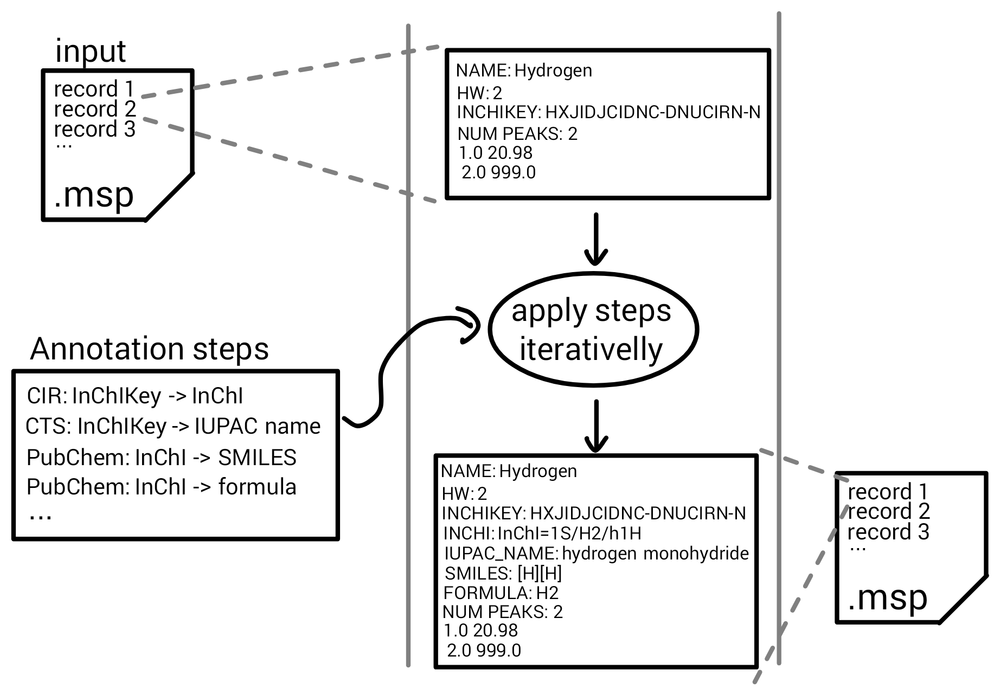

# Summary

MSMetaEnhancer is a Python software package for the metadata enrichment of entries in spectral library files. 
The package uses matchms [@Huber2020] for data IO and supports the open, text-based `.msp` format.
Entries contain mass spectral information such as peak mass to charge (m/z) ratios and intensities, alongside metadata information.
It annotates given mass spectra in the library file by adding missing metadata such as SMILES, InChI, and CAS numbers to the individual entries.
The package retrieves the medatada by querying several external databases, 
currently supporting the chemical identifier resolver (CIR), chemical translation service (CTS) [@Wohlgemuth2010], ChemIDplus [@tomasulo2002chemidplus], and IDSM [@galgonek2021idsm].

# Statement of need

Mass spectra stored in a library need to be enriched with metadata (e.g chemical formula, SMILES code, InChI, the origin of the spectrum, etc.) to make the identification process more robust and reproducible and to leverage the interoperability capabilities of chemical databases.
While this metadata is mostly accessible from public chemical databases, they are not always present in mass spectral libraries. 
Therefore, the data needs to be post-processed and appropriate metadata gathered from reliable sources.
Such a process usually cannot be fully automated, and assistance from the user is required to specify particular annotation steps and sources. 

# State of the field

There are several packages within Python and R ecosystems which support querying external databases. 
For example, there are R packages that provide an interface to PubChem [@guha2016; @cao2008chemminer], and a package with interface to wikidata [@keys2021]. 
Then, there are packages unifying several sources -- `webchem` [@szocs2020webchem] allows to automatically query chemical data from several web sources and `MetaFetcheR`[@yones2021metafetcher] links metabolite data from several small-compound databases, trying to resolve inconsistencies.

On the Python side, there are packages for PubChem [@swain2017], ChemSpider [@swain2018], or CIR [@swain2016]. 
However, to the best of our knowledge, there is no Python package connecting these sources into a single tool, allowing straightforward metadata annotation of mass spectra.

# The software package

MSMetaEnhancer is an annotation tool for mass spectra files.
It takes as input a single `.msp` file with multiple mass spectra records and a list of annotation steps.
These steps consist of specifying what service should be used to obtain a particular metadata attribute based on another already existing attribute.
The supported services include, among others, CIR, CTS, ChemIDplus, and IDSM.
To improve the performance of the tool, we use services with high-throughput APIs when available (e.g. IDSM [@galgonek2021idsm], which can be used to access PubChem database).
The supported metadata attributes include InChI, InChIKey, SMILES, IUPAC chemical name, chemical formula, CAS number, and others. 
The particular available conversions can be found in the documentation via https://msmetaenhancer.readthedocs.io/.
Finally, the obtained metadata are validated to ensure their correct form (currently, matchms [@Huber2020] validators are employed for this task).

The tool processes the spectral library by iteratively executing all steps for each entry until no new metadata is found. 
This happens for each spectra record in the provided file. 
Since it takes some non-trivial time for the services to respond to a query, this task is suitable for the asynchronous approach, making the tool computationally efficient.
Any issues regarding the annotation process (such as the absence of target data or unavailability of a service) are recorded in a detailed log file, which can be specified as an optional output of the tool.



To improve the usability of the tool, a Galaxy [@galaxy] wrapper was created to provide a user-friendly interface and a simple way of reproducible data processing and analysis. The tool is hosted on the Galaxy instance available at https://umsa.cerit-sc.cz/, among others [@umsa]. Moreover, the tool is available from bioconda [@bioconda] as a standalone package.

# Example workflow

Performing annotation of a `.msp` file is straightforward and requires to specify services to be used and a list of annotation steps.

```python
import asyncio
from MSMetaEnhancer import Application

app = Application()
# import your .msp file
app.load_spectra('input_spectra_file.msp', file_format='msp')
# specify services
services = ['CIR', 'CTS', 'IDSM']

# specify annotation steps
jobs = [('inchikey', 'inchi', 'CIR'),
        ('inchikey', 'iupac_name', 'CTS'),
        ('inchi', 'canonical_smiles', 'IDSM'),
        ('inchi', 'formula', 'IDSM')]

# run asynchronous annotation of spectra data
asyncio.run(app.annotate_spectra(services, jobs))
# export .msp file
app.save_spectra('annotated_spectra_file.msp', file_format='msp')
```

# Author's Contributions
MT wrote the manuscript and developed the software.
HH contributed to the manuscript and via code reviews and implementation guidance.
MČ contributed via code reviews and implementation guidance.
EJP provided conceptual oversight and contributed to the manuscript.

# Acknowledgements
The work was supported from Operational Programme Research, Development and Innovation - project RECETOX RI - CZ.02.1.01/0.0/0.0/16_013/0001761.
This project has received funding from the European Union’s Horizon 2020 research and innovation programme under grant agreement No 857560.
This publication/presentation reflects only the author's view and the European Commission is not responsible for any use that may be made of the information it contains.

# References